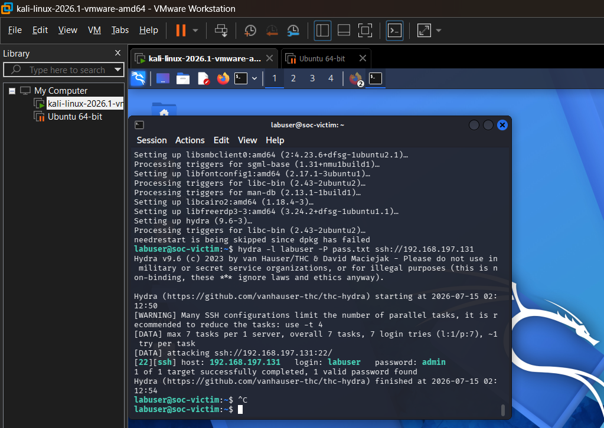
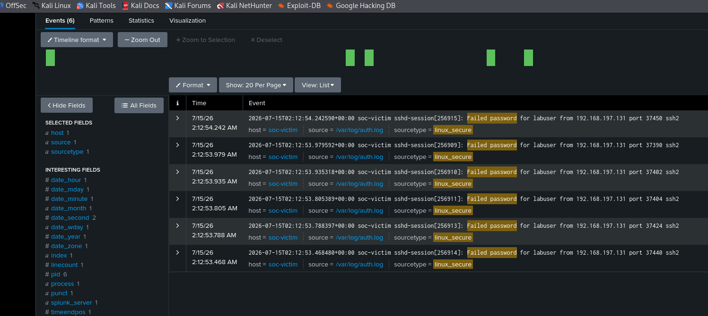
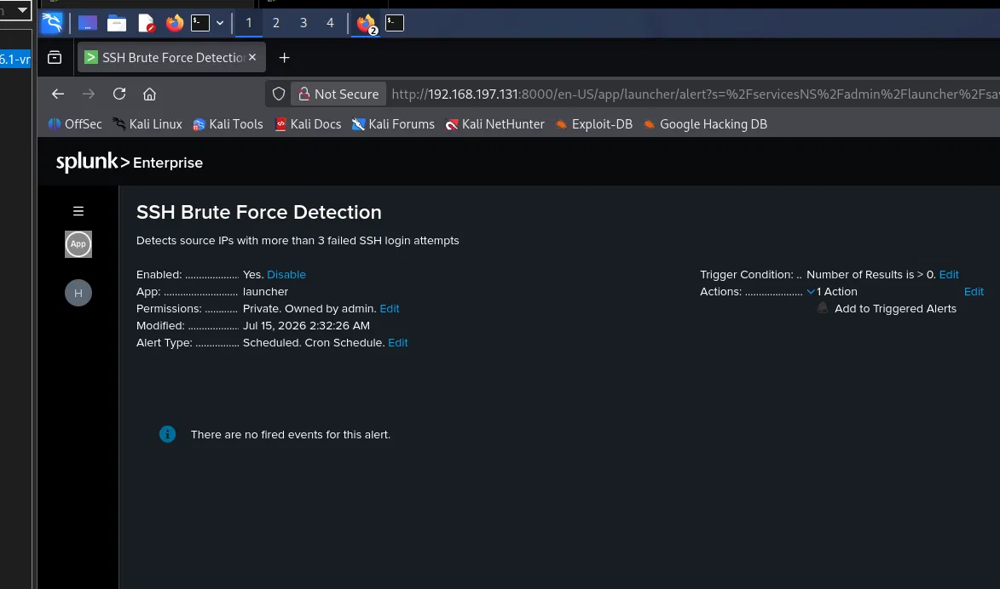

# SSH Brute-Force Detection in Splunk

A home-lab SOC project simulating SSH brute-force attacks and building Splunk detections to identify credential abuse — modeled on real Tier-1 SOC alert triage workflows.

## 🎯 Objective

Simulate a common attack technique (SSH brute-force) against a target host, ingest the resulting logs into Splunk, and build a detection + investigation workflow that mirrors how a SOC analyst would triage and escalate the alert in a production environment.

**MITRE ATT&CK mapping:** T1110 – Brute Force

##  Lab Architecture

```
[Attacker VM: Kali Linux] ---> SSH attempts ---> [Victim VM: Ubuntu/Linux Server]
                                                          |
                                                          v
                                              [Splunk Universal Forwarder]
                                                          |
                                                          v
                                              [Splunk Server: indexing, dashboard, alert]
```

- **Attacker:** Kali Linux (Hydra / Medusa for brute-force)
- **Victim:** Ubuntu Server (OpenSSH, `auth.log`)
- **SIEM:** Splunk Free (Universal Forwarder → Indexer)
- **Network:** Isolated internal/host-only network (VirtualBox/VMware)

> *(Add a network diagram screenshot here once your lab is running)*

## 🛠️ Tools Used

| Tool | Purpose |
|---|---|
| Kali Linux | Attack simulation |
| Hydra | SSH brute-force tool |
| Splunk Free | Log ingestion, search, dashboards, alerting |
| Splunk Universal Forwarder | Ships `auth.log` from victim to Splunk |

##  Build Steps

1. Stood up two VMs (attacker + victim) on an isolated host-only network
2. Installed and configured Splunk Universal Forwarder on the victim to forward `/var/log/auth.log`
3. Confirmed log ingestion in Splunk and built a baseline dashboard of normal SSH login activity
4. Ran a brute-force attack from Kali using Hydra against the victim's SSH service
5. Built a Splunk search/alert to detect the attack pattern (see below)
6. Investigated the resulting alert and documented findings as an incident report

## 🔍 Detection Logic

**SPL query used to detect brute-force activity:**

```spl
index=main sourcetype=linux_secure "Failed password"
| stats count by src_ip, user
| where count > 5
```

**Alert condition:** Trigger when a single source IP exceeds 5 failed login attempts within a 5-minute window, optionally followed by a successful login (indicating a compromised credential).

##  Investigation Report

| Field | Detail |
|---|---|
| **Alert** | Multiple failed SSH login attempts from single source |
| **Source IP** | *(fill in)* |
| **Target** | *(fill in — victim hostname/IP)* |
| **Time window** | *(fill in)* |
| **Attempts observed** | *(fill in count)* |
| **Outcome** | *(fill in — was it a successful compromise or blocked?)* |
| **Severity** | *(Low/Medium/High — justify your rating)* |

**Findings:**
*(2–3 sentences: what the logs showed, how you confirmed it was brute-force activity and not legitimate user error)*

**Recommendation:**
*(e.g., implement fail2ban, enforce key-based auth, rate-limit or geo-block source IP, lower alert threshold)*

## 📸 Screenshots
**Hydra brute-force attack against the victim host**


**Raw failed login events captured in Splunk**


<!--**Detection query with extracted fields (src_ip, user)**
-->

**Saved Splunk alert configuration**



##  Lessons Learned

*(2–4 sentences: what surprised you, what you'd tune differently, what a false positive might look like for this detection)*

## 🔗 Next Steps

- Extend detection to include successful-login-after-failures correlation
- Tune alert threshold to reduce false positives (see [Detection Rule Tuning project])
- Port the same detection logic to Microsoft Sentinel for multi-SIEM experience
